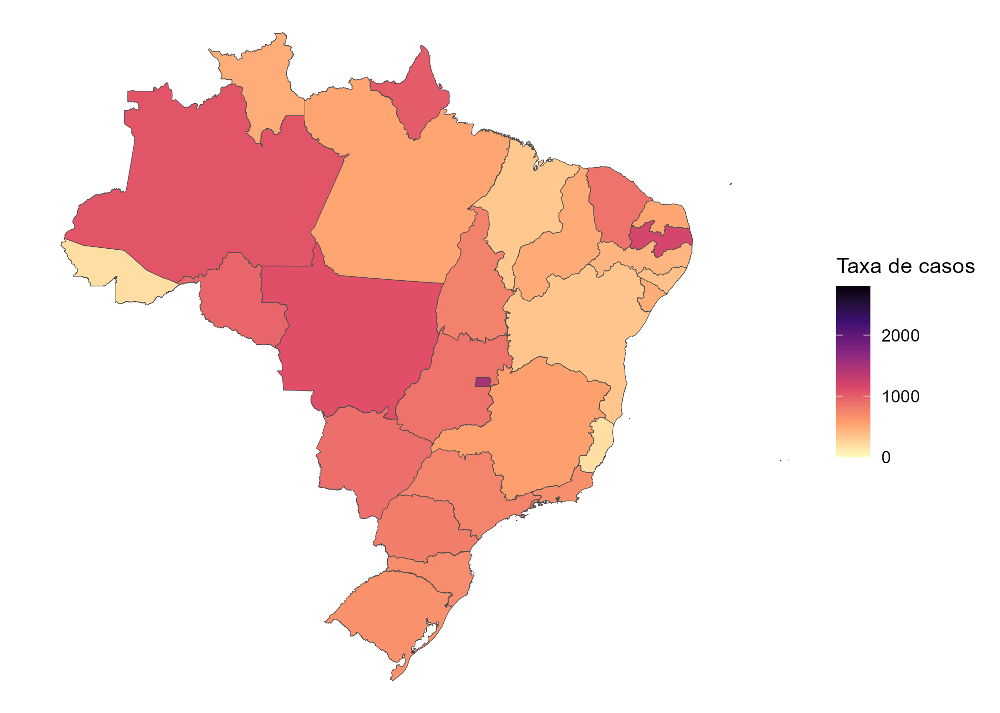
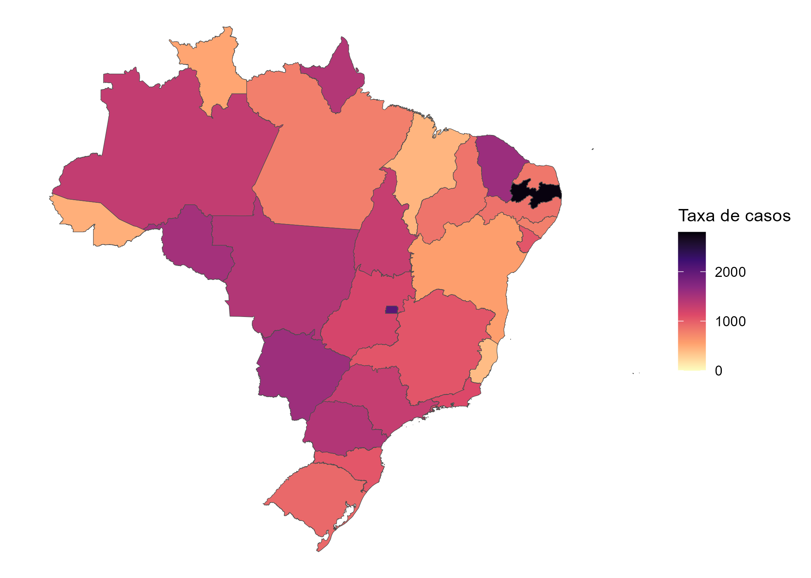
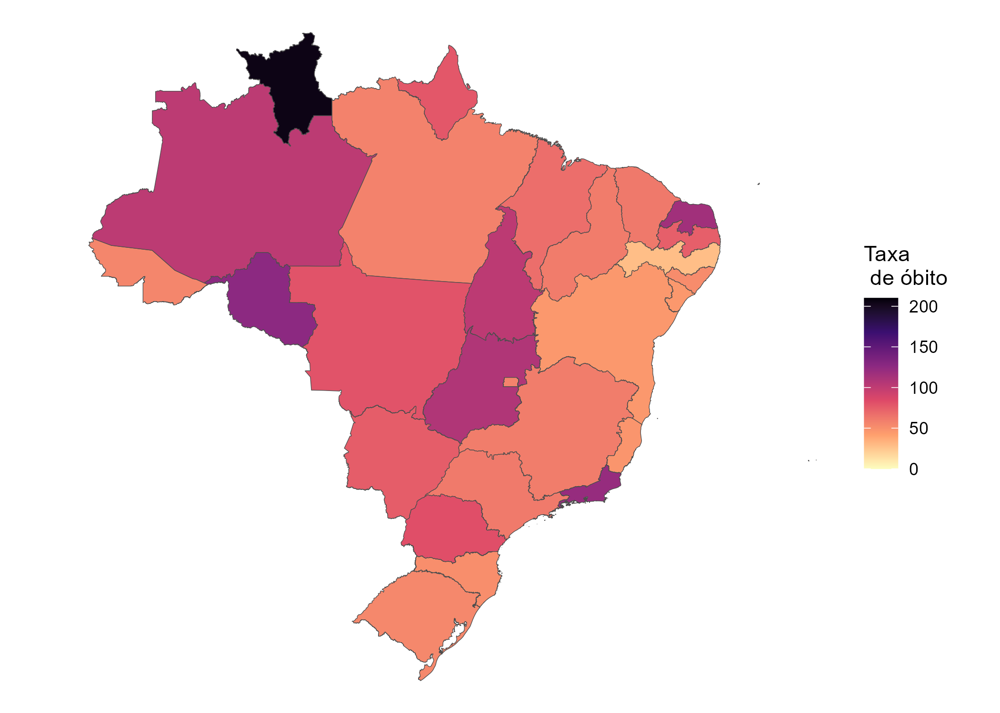

```{r setup, include=FALSE}
#shiny
library(flexdashboard)
library(shinyWidgets)
#data
library(tidyverse)
library(summarytools)
library(modelsummary)
library(gt)
library(readr)
library(readxl)
#model
library(tidymodels)
library(xgboost)
library(probably)
#graph
library(ggplot2)
library(highcharter)
library(viridisLite)
library(viridis)
library(scales)
library(plotly)
#interpretability
library(iml)
library(rcompanion)
library(effectsize)

#functions for summary measures
media <- function(x)
mean(x, na.rm = TRUE)
mediana <- function(x)
median(x, na.rm = TRUE)
DP <- function(x)
sd(x, na.rm = TRUE)
minimo <- function(x)
base::min(x, na.rm = TRUE)
maximo <- function(x)
base::max(x, na.rm = TRUE)
q25 <- function(x)
stats::quantile(x, p = 0.25, na.rm = TRUE)
q75 <- function(x)
stats::quantile(x, p = 0.75, na.rm = TRUE)
IQR <- function(x)
round(q75(x) - q25(x), 2)
n <- function(x)
sum(!is.na(x))

# Dados -------

# covid x não-covid (treino)

dados_modelo <- readRDS("dados_real.rds")

# covid x nao-covid (teste do modelo)

dados <- readRDS("dados_preditos_novo.rds") %>% 
  mutate(classi_gesta_puerp = droplevels(.$classi_gesta_puerp, except = c(1:4, 6))) %>% 
  filter(as.Date(DT_SIN_PRI, format = "%d/%m/%Y") >= as.Date("16/02/2020", format = "%d/%m/%Y")) 

# covid real x covid predita

dados_covid <- readRDS("dados_real.rds") %>% 
  mutate(classi_fin = ifelse(classi_fin == "covid-19", "covid real", "não-covid")) %>% 
  filter(as.Date(DT_SIN_PRI, format = "%d/%m/%Y") >= as.Date("16/02/2020", format = "%d/%m/%Y")) %>% 
  filter(classi_fin == "covid real")

dados_aux <- dados %>% 
  rename(classi_fin = classi_fin_pred) %>% 
  mutate(classi_fin = ifelse(classi_fin == "covid-19", "covid predita", "não-covid")) %>% 
  filter(classi_fin == "covid predita")

dados_covid <- full_join(dados_covid, dados_aux) 

```

COVID x Não COVID (treino) {data-navmenu="Descritiva"}
===================================

Inputs{.sidebar data-width=350}
---------------------
<br>
```{r}
shiny::radioButtons(
  inputId = "RadioVarR", 
  label = "Selecione o grupo de variáveis:",
  choices = list("variáveis do modelo" = "modelo", "todas as variáveis" = "todas"),
  selected = "todas"
)

hr()

shiny::conditionalPanel(
  condition = "input.RadioVarR == 'modelo'",
  shiny::selectInput(
  inputId = "SelectVar1R",
  label = "Selecione a variável (coluna):",
  choices = c(
    "momento gestacional"="classi_gesta_puerp",
    "raça"="raca",
    "escolaridade"="escolaridade",
    "idade"="idade",
    "vacina"="vacina",
    "febre"="febre",
    "tosse"="tosse",
    "garganta"="garganta",
    "dispneia"="dispneia",
    "desconforto respiratório"="desc_resp",
    "saturação"="saturacao",
    "diarreia"="diarreia",
    "cardiopatia"="cardiopatia",
    "pneumopatia"="pneumopatia",
    "renal"="renal",
    "obesidade"="obesidade"
  ),
  selected = "febre",
  multiple = FALSE
 )
)

shiny::conditionalPanel(
  condition = "input.RadioVarR == 'todas'",
  shiny::selectInput(
  inputId = "SelectVar2R",
  label = "Selecione a variável (coluna):",
  choices = c(
    "uf"="SG_UF",
    "momento gestacional"="classi_gesta_puerp",
    "raça"="raca",
    "escolaridade"="escolaridade",
    "idade"="idade",
    "vacina"="vacina",
    "febre"="febre",
    "tosse"="tosse",
    "garganta"="garganta",
    "dispneia"="dispneia",
    "desconforto respiratório"="desc_resp",
    "saturação"="saturacao",
    "diarreia"="diarreia",
    "dor abdominal"="dor_abd",
    "fadiga"="fadiga",
    "perda de olfato"="perd_olft",
    "perda de paladar"="perd_pala",
    "cardiopatia"="cardiopatia",
    "pneumopatia"="pneumopatia",
    "renal"="renal",
    "obesidade"="obesidade",
    "diabetes"="diabetes",
    "evolução"="evolucao",
    "uti"="uti",
    "suporte ventilatório"="suport_ven",
    "intubação"="intubacao_SN"
  ),
  selected = "fadiga",
  multiple = FALSE
 )
)
```

Row {.tabset}
---------------------

### Análise conjunta

```{r}
shiny::renderPrint({
  if(input$RadioVarR == 'modelo'){
    if(input$SelectVar1R == "idade"){
      print(datasummary((classi_fin) ~  idade*(n+media+DP+mediana+minimo+maximo+q25+q75+IQR),
data = dados_modelo, output = 'markdown'))
      print("Teste T")
      t.test(idade ~ classi_fin, data = dados_modelo)
    }
    else{
      st_options(headings = FALSE, display.labels = FALSE)
      with(
      dados_modelo,
      summarytools::ctable(
        classi_fin,
        get(input$SelectVar1R),
        prop = "r",
        headings = st_options("headings"),
        display.labels = st_options("display.labels"),
        dnn = c("caso",input$SelectVar1R ),
        chisq = TRUE,
       )
     )}
  }
  else if(input$RadioVarR == 'todas'){
    if(input$SelectVar2R == "idade"){
      print(datasummary((classi_fin) ~  idade*(n+media+DP+mediana+minimo+maximo+q25+q75+IQR),
data = dados_modelo, output = 'markdown'))
      print("Teste T")
      t.test(idade ~ classi_fin, data = dados_modelo)
    }
    else{
      st_options(headings = FALSE, display.labels = FALSE)
      with(
      dados_modelo,
      summarytools::ctable(
        classi_fin,
        get(input$SelectVar2R),
        prop = "r",
        headings = st_options("headings"),
        display.labels = st_options("display.labels"),
        dnn = c("caso",input$SelectVar2R),
        chisq = TRUE,
       )
     )}
  }
})
```

### Teste V de Cramer

```{r}
print("cramer <= 0.2 - Fraco")
print("0.2 < cramer <= 0.6 - moderado")
print("cramer > 0.6 - forte")
shiny::renderPrint({
  if(input$RadioVarR == 'modelo'){
  with(dados_modelo,
       cramerV(classi_fin,get(input$SelectVar1R)))
  }
  else if(input$RadioVarR == 'todas'){
    with(dados_modelo,
       cramerV(classi_fin,get(input$SelectVar2R)))
  }
})

```

### Teste de Fisher

```{r}
shiny::renderPrint({
  if(input$RadioVarR == 'modelo'){
  with(dados_modelo,
       fisher.test(classi_fin, get(input$SelectVar1R), workspace = 2000000, simulate.p.value = TRUE))
  }
  else if(input$RadioVarRP == 'todas'){
    with(dados_modelo,
       fisher.test(classi_fin, get(input$SelectVar2R), workspace = 2000000, simulate.p.value = TRUE))
  }
})
```

### C de Cohen

```{r}
print("Tamanho do efeito para idade")
c_cohen <- cohens_d(idade ~ as.factor(classi_fin),data=dados_modelo)
c_cohen
```

Row {data-width=450}
---------------------

### Gráfico Conjunto

```{r}
dados_hc_auxR <- shiny::reactive({
    dados_modelo %>%
      count(var = .[["classi_fin"]]) %>%
      mutate(ntot = n) %>%
      select(-n)
})
  
dados_hcR <- shiny::reactive({
    if(input$RadioVarR == 'modelo'){
    dados_modelo %>%
      count(var = .[["classi_fin"]],
            var2 = .[[input$SelectVar1R]]) %>%
      full_join(dados_hc_auxR(), by = "var") %>%
      mutate(porc = round((n / ntot) * 100, 2))
    }
    
    else if(input$RadioVarR == 'todas'){ 
      dados_modelo %>%
      count(var = .[["classi_fin"]],
            var2 = .[[input$SelectVar2R]]) %>%
      full_join(dados_hc_auxR(), by = "var") %>%
      mutate(porc = round((n / ntot) * 100, 2))
    }
})
  
cols <- viridis::magma(5)
cols <- substr(cols, 0, 7)
  
highcharter::renderHighchart({
  if(input$RadioVarR == 'modelo'){
      if(input$SelectVar1R !="idade"){
        hchart(dados_hcR(), type = "column",
               hcaes(x = var,
                     y = porc, group = var2), stacking="normal") %>%
          hc_xAxis(title = list(text = "classi_fin")) %>%
          hc_yAxis(title = list(text = "%")) %>%
          hc_add_theme(hc_theme_elementary()) %>% 
          hc_colors(cols) 
        }
     else{
     highchart() %>%
       hc_xAxis(type = "category",title = list(text = "classi_fin")) %>%
       hc_add_series_list(data_to_boxplot(dados_modelo,idade,classi_fin,group_var = classi_fin,fillColor=c("#B63679","#FB8861"),color=c("#51127C","#000004"))) %>% 
       hc_add_theme(hc_theme_elementary())
       }
    }
  else if(input$RadioVarR == 'todas'){
    if(input$SelectVar2R !="idade"){
        hchart(dados_hcR(), type = "column",
               hcaes(x = var,
                     y = porc, group = var2), stacking="normal") %>%
          hc_xAxis(title = list(text = "classi_fin")) %>%
          hc_yAxis(title = list(text = "%")) %>%
          hc_add_theme(hc_theme_elementary()) %>% 
          hc_colors(cols) }
     else{
     highchart() %>%
       hc_xAxis(type = "category",title = list(text = "classi_fin")) %>%
       hc_add_series_list(data_to_boxplot(dados_modelo,idade,classi_fin,group_var = classi_fin,fillColor=c("#B63679","#FB8861"),color=c("#51127C","#000004"))) %>% 
       hc_add_theme(hc_theme_elementary())}
  }
})


```

### Gráfico de frequência

```{r}
dados_hc_auxRR <- shiny::reactive({
   if(input$RadioVarR == 'modelo'){
    dados_modelo %>%
      count(var = .[[input$SelectVar1R]]) %>%
      mutate(ntot = sum(n))  %>%
      mutate(porc = round((n / ntot) * 100, 2))
   }
   
   else if(input$RadioVarR == 'todas'){
     dados_modelo %>%
      count(var = .[[input$SelectVar2R]]) %>%
      mutate(ntot = sum(n))  %>%
      mutate(porc = round((n / ntot) * 100, 2))
   }
})

cols <- viridis::magma(5)
cols <- substr(cols, 0, 7)
  
highcharter::renderHighchart({
  if(input$RadioVarR == 'modelo'){
    if(input$SelectVar1R !="idade"){
      hchart(dados_hc_auxRR(), type = "bar",
             hcaes(x = var, y = porc, group = var)) %>%
        hc_xAxis(title = list(text = "variável")) %>%
        hc_yAxis(title = list(text = "%")) %>%
        hc_add_theme(hc_theme_elementary()) %>% 
        hc_colors(cols) 
      }
    else{
     hchart(dados_modelo$idade,color="#B63679",name="Idade",breaks = 10) 
    }}
  else if(input$RadioVarR == 'todas')
    if(input$SelectVar2R !="idade"){
      hchart(dados_hc_auxRR(), type = "bar",
             hcaes(x = var, y = porc, group = var)) %>%
        hc_xAxis(title = list(text = "variável")) %>%
        hc_yAxis(title = list(text = "%")) %>%
        hc_add_theme(hc_theme_elementary()) %>% 
        hc_colors(cols) 
      }
    else{
     hchart(dados_modelo$idade,color="#B63679",name="Idade",breaks = 10) 
    }
})
```

COVID x Não COVID (teste) {data-navmenu="Descritiva"}
===================================

Inputs{.sidebar data-width=350}
---------------------
<br>
```{r}
shiny::radioButtons(
  inputId = "RadioVar", 
  label = "Selecione o grupo de variáveis:",
  choices = list("variáveis do modelo" = "modelo", "todas as variáveis" = "todas"),
  selected = "todas"
)

hr()

shiny::conditionalPanel(
  condition = "input.RadioVar == 'modelo'",
  shiny::selectInput(
  inputId = "SelectVar1",
  label = "Selecione a variável (coluna):",
  choices = c(
    "momento gestacional"="classi_gesta_puerp",
    "raça"="raca",
    "escolaridade"="escolaridade",
    "idade"="idade",
    "vacina"="vacina",
    "febre"="febre",
    "tosse"="tosse",
    "garganta"="garganta",
    "dispneia"="dispneia",
    "desconforto respiratório"="desc_resp",
    "saturação"="saturacao",
    "diarreia"="diarreia",
    "cardiopatia"="cardiopatia",
    "pneumopatia"="pneumopatia",
    "renal"="renal",
    "obesidade"="obesidade"
  ),
  selected = "febre",
  multiple = FALSE
 )
)

shiny::conditionalPanel(
  condition = "input.RadioVar == 'todas'",
  shiny::selectInput(
  inputId = "SelectVar2",
  label = "Selecione a variável (coluna):",
  choices = c(
    "uf"="SG_UF",
    "momento gestacional"="classi_gesta_puerp",
    "raça"="raca",
    "escolaridade"="escolaridade",
    "idade"="idade",
    "vacina"="vacina",
    "febre"="febre",
    "tosse"="tosse",
    "garganta"="garganta",
    "dispneia"="dispneia",
    "desconforto respiratório"="desc_resp",
    "saturação"="saturacao",
    "diarreia"="diarreia",
    "dor abdominal"="dor_abd",
    "fadiga"="fadiga",
    "perda de olfato"="perd_olft",
    "perda de paladar"="perd_pala",
    "cardiopatia"="cardiopatia",
    "pneumopatia"="pneumopatia",
    "renal"="renal",
    "obesidade"="obesidade",
    "diabetes"="diabetes",
    "evolução"="evolucao",
    "uti"="uti",
    "suporte ventilatório"="suport_ven",
    "intubação"="intubacao_SN"
  ),
  selected = "fadiga",
  multiple = FALSE
 )
)
```

Row {.tabset}
---------------------

### Análise conjunta

```{r}
shiny::renderPrint({
  if(input$RadioVar == 'modelo'){
    if(input$SelectVar1 == "idade"){
      print(datasummary((classi_fin_pred) ~  idade*(n+media+DP+mediana+minimo+maximo+q25+q75+IQR),
data = dados, output = 'markdown'))
      print("Teste T")
      t.test(idade ~ classi_fin_pred, data = dados)
    }
    else{
      st_options(headings = FALSE, display.labels = FALSE)
      with(
      dados,
      summarytools::ctable(
        classi_fin_pred,
        get(input$SelectVar1),
        prop = "r",
        headings = st_options("headings"),
        display.labels = st_options("display.labels"),
        dnn = c("caso",input$SelectVar1),
        chisq = TRUE,
       )
     )}
  }
  else if(input$RadioVar == 'todas'){
    if(input$SelectVar2 == "idade"){
      print(datasummary((classi_fin_pred) ~  idade*(n+media+DP+mediana+minimo+maximo+q25+q75+IQR),
data = dados, output = 'markdown'))
      print("Teste T")
      t.test(idade ~ classi_fin_pred, data = dados)
    }
    else{
      st_options(headings = FALSE, display.labels = FALSE)
      with(
      dados,
      summarytools::ctable(
        classi_fin_pred,
        get(input$SelectVar2),
        prop = "r",
        headings = st_options("headings"),
        display.labels = st_options("display.labels"),
        dnn = c("caso",input$SelectVar2),
        chisq = TRUE,
       )
     )}
  }
})
```

### Teste V de Cramer

```{r}
print("V <= 0,2 - associação fraca")
print("0,2 < V <= 0,6 - associação moderada")
print("V > 0,6 - associação forte")

shiny::renderPrint({
  if(input$RadioVar == 'modelo'){
  with(dados,
       cramerV(classi_fin_pred,get(input$SelectVar1)))
  }
  else if(input$RadioVar == 'todas'){
    with(dados,
       cramerV(classi_fin_pred,get(input$SelectVar2)))
  }
})

```

### Teste de Fisher

```{r}
shiny::renderPrint({
  if(input$RadioVar == 'modelo'){
  with(dados,
       fisher.test(classi_fin_pred,get(input$SelectVar1), workspace = 2000000, simulate.p.value = TRUE))
  }
  else if(input$RadioVar == 'todas'){
    with(dados,
       fisher.test(classi_fin_pred,get(input$SelectVar2), workspace = 2000000, simulate.p.value = TRUE))
  }
})
```

### C de Cohen

```{r}
print("Tamanho de efeito para idade")
c_cohen <- cohens_d(idade ~ as.factor(classi_fin_pred),data=dados)
c_cohen
```

Row {data-width=450}
---------------------

### Gráfico Conjunto

```{r}
dados_hc_aux <- shiny::reactive({
    dados %>%
      count(var = .[["classi_fin_pred"]]) %>%
      mutate(ntot = n) %>%
      select(-n)
})
  
dados_hc <- shiny::reactive({
    if(input$RadioVar == 'modelo'){
    dados %>%
      count(var = .[["classi_fin_pred"]],
            var2 = .[[input$SelectVar1]]) %>%
      full_join(dados_hc_aux(), by = "var") %>%
      mutate(porc = round((n / ntot) * 100, 2))
    }
    
    else if(input$RadioVar == 'todas'){ 
      dados %>%
      count(var = .[["classi_fin_pred"]],
            var2 = .[[input$SelectVar2]]) %>%
      full_join(dados_hc_aux(), by = "var") %>%
      mutate(porc = round((n / ntot) * 100, 2))
    }
})
  
cols <- viridis::magma(5)
cols <- substr(cols, 0, 7)
  
highcharter::renderHighchart({
  if(input$RadioVar == 'modelo'){
    if(input$SelectVar1 !="idade"){
      hchart(dados_hc(), type = "column",
             hcaes(x = var,
                   y = porc, group = var2), stacking="normal") %>%
        hc_xAxis(title = list(text = "classi_fin")) %>%
        hc_yAxis(title = list(text = "%")) %>%
        hc_add_theme(hc_theme_elementary()) %>% 
        hc_colors(cols) }
   else if ((input$SelectVar1 =="idade" & input$RadioVar == 'modelo') | (input$RadioVar == 'todas' & input$SelectVar2 =="idade")){
     highchart() %>%
       hc_xAxis(type = "category",title = list(text = "classi_fin")) %>%
       hc_add_series_list(data_to_boxplot(dados,idade,classi_fin_pred,group_var = classi_fin_pred,fillColor=c("#B63679","#FB8861"),color=c("#51127C","#000004"))) %>% 
       hc_add_theme(hc_theme_elementary())
   }
  }
  else if(input$RadioVar == 'todas'){
    if(input$SelectVar2 !="idade"){
      hchart(dados_hc(), type = "column",
             hcaes(x = var,
                   y = porc, group = var2), stacking="normal") %>%
        hc_xAxis(title = list(text = "classi_fin")) %>%
        hc_yAxis(title = list(text = "%")) %>%
        hc_add_theme(hc_theme_elementary()) %>% 
        hc_colors(cols) }
   else if ((input$SelectVar1 =="idade" & input$RadioVar == 'modelo') | (input$RadioVar == 'todas' & input$SelectVar2 =="idade")){
     highchart() %>%
       hc_xAxis(type = "category",title = list(text = "classi_fin")) %>%
       hc_add_series_list(data_to_boxplot(dados,idade,classi_fin_pred,group_var = classi_fin_pred,fillColor=c("#B63679","#FB8861"),color=c("#51127C","#000004"))) %>% 
       hc_add_theme(hc_theme_elementary())
   }
  } 
})
```

### Gráfico de frequência

```{r}
dados_hc_aux1 <- shiny::reactive({
   if(input$RadioVar == 'modelo'){
    dados %>%
      count(var = .[[input$SelectVar1]]) %>%
      mutate(ntot = sum(n))  %>%
      mutate(porc = round((n / ntot) * 100, 2))
   }
   
   else if(input$RadioVar == 'todas'){
     dados %>%
      count(var = .[[input$SelectVar2]]) %>%
      mutate(ntot = sum(n))  %>%
      mutate(porc = round((n / ntot) * 100, 2))
   }
})

cols <- viridis::magma(5)
cols <- substr(cols, 0, 7)
  
highcharter::renderHighchart({
  if(input$RadioVar == 'modelo'){
    if(input$SelectVar1 !="idade"){
      hchart(dados_hc_aux1(), type = "bar",
             hcaes(x = var,
                   y = porc, group=var)) %>%
        hc_xAxis(title = list(text = "variável")) %>%
        hc_yAxis(title = list(text = "%")) %>%
        hc_add_theme(hc_theme_elementary()) %>% 
        hc_colors(cols) 
    }
    else if ((input$SelectVar1 =="idade" & input$RadioVar == 'modelo') | (input$RadioVar == 'todas' & input$SelectVar2 =="idade")){
      hchart(dados$idade,color="#B63679",name="Idade",breaks = 10) 
    }
  }
  else if(input$RadioVar == 'todas'){
    if(input$SelectVar2 !="idade"){
      hchart(dados_hc_aux1(), type = "bar",
             hcaes(x = var,
                   y = porc, group=var)) %>%
        hc_xAxis(title = list(text = "variável")) %>%
        hc_yAxis(title = list(text = "%")) %>%
        hc_add_theme(hc_theme_elementary()) %>% 
        hc_colors(cols) 
    }
    else if ((input$SelectVar1 =="idade" & input$RadioVar == 'modelo') | (input$RadioVar == 'todas' & input$SelectVar2 =="idade")){
      hchart(dados$idade,color="#B63679",name="Idade",breaks = 10) 
    }
  }
})
```

COVID Real x COVID Predita {data-navmenu="Descritiva"}
===================================

Inputs{.sidebar data-width=350}
---------------------
<br>
```{r}
shiny::radioButtons(
  inputId = "RadioVarRP", 
  label = "Selecione o grupo de variáveis:",
  choices = list("variáveis do modelo" = "modelo", "todas as variáveis" = "todas"),
  selected = "todas"
)

hr()

shiny::conditionalPanel(
  condition = "input.RadioVarRP == 'modelo'",
  shiny::selectInput(
  inputId = "SelectVar1RP",
  label = "Selecione a variável (coluna):",
  choices = c(
    "momento gestacional"="classi_gesta_puerp",
    "raça"="raca",
    "escolaridade"="escolaridade",
    "idade"="idade",
    "vacina"="vacina",
    "febre"="febre",
    "tosse"="tosse",
    "garganta"="garganta",
    "dispneia"="dispneia",
    "desconforto respiratório"="desc_resp",
    "saturação"="saturacao",
    "diarreia"="diarreia",
    "cardiopatia"="cardiopatia",
    "pneumopatia"="pneumopatia",
    "renal"="renal",
    "obesidade"="obesidade"
  ),
  selected = "febre",
  multiple = FALSE
 )
)

shiny::conditionalPanel(
  condition = "input.RadioVarRP == 'todas'",
  shiny::selectInput(
  inputId = "SelectVar2RP",
  label = "Selecione a variável (coluna):",
  choices = c(
    "uf"="SG_UF",
    "momento gestacional"="classi_gesta_puerp",
    "raça"="raca",
    "escolaridade"="escolaridade",
    "idade"="idade",
    "vacina"="vacina",
    "febre"="febre",
    "tosse"="tosse",
    "garganta"="garganta",
    "dispneia"="dispneia",
    "desconforto respiratório"="desc_resp",
    "saturação"="saturacao",
    "diarreia"="diarreia",
    "dor abdominal"="dor_abd",
    "fadiga"="fadiga",
    "perda de olfato"="perd_olft",
    "perda de paladar"="perd_pala",
    "cardiopatia"="cardiopatia",
    "pneumopatia"="pneumopatia",
    "renal"="renal",
    "obesidade"="obesidade",
    "diabetes"="diabetes",
    "evolução"="evolucao",
    "uti"="uti",
    "suporte ventilatório"="suport_ven",
    "intubação"="intubacao_SN"
  ),
  selected = "fadiga",
  multiple = FALSE
 )
)
```

Row {.tabset}
---------------------

### Análise conjunta

```{r}
shiny::renderPrint({
  if(input$RadioVarRP == 'modelo'){
    if(input$SelectVar1RP == "idade"){
      print(datasummary((classi_fin) ~  idade*(n+media+DP+mediana+minimo+maximo+q25+q75+IQR),
data = dados_covid, output = 'markdown'))
      print("Teste T")
      t.test(idade ~ classi_fin, data = dados_covid)
    }
    else{
      st_options(headings = FALSE, display.labels = FALSE)
      with(
      dados_covid,
      summarytools::ctable(
        classi_fin,
        get(input$SelectVar1RP),
        prop = "r",
        headings = st_options("headings"),
        display.labels = st_options("display.labels"),
        dnn = c("caso",input$SelectVar1RP ),
        chisq = TRUE,
       )
     )}
  }
  else if(input$RadioVarRP == 'todas'){
    if(input$SelectVar2RP == "idade"){
      print(datasummary((classi_fin) ~  idade*(n+media+DP+mediana+minimo+maximo+q25+q75+IQR),
data = dados_covid, output = 'markdown'))
      print("Teste T")
      t.test(idade ~ classi_fin, data = dados_covid)
    }
    else{
      st_options(headings = FALSE, display.labels = FALSE)
      with(
      dados_covid,
      summarytools::ctable(
        classi_fin,
        get(input$SelectVar2RP),
        prop = "r",
        headings = st_options("headings"),
        display.labels = st_options("display.labels"),
        dnn = c("caso",input$SelectVar2RP),
        chisq = TRUE,
       )
     )}
  }
})
```

### Teste V de Cramer

```{r}
print("cramer <= 0.2 - Fraco")
print("0.2 < cramer <= 0.6 - moderado")
print("cramer > 0.6 - forte")
shiny::renderPrint({
  if(input$RadioVarRP == 'modelo'){
  with(dados_covid,
       cramerV(classi_fin,get(input$SelectVar1RP)))
  }
  else if(input$RadioVarRP == 'todas'){
    with(dados_covid,
       cramerV(classi_fin,get(input$SelectVar2RP)))
  }
})

```

### Teste de Fisher

```{r}
shiny::renderPrint({
  if(input$RadioVarRP == 'modelo'){
  with(dados_covid,
       fisher.test(classi_fin, get(input$SelectVar1RP), workspace = 2000000, simulate.p.value = TRUE))
  }
  else if(input$RadioVarRP == 'todas'){
    with(dados_covid,
       fisher.test(classi_fin, get(input$SelectVar2RP), workspace = 2000000, simulate.p.value = TRUE))
  }
})
```

### C de Cohen

```{r}
print("Tamanho de efeito para idade")
c_cohen <- cohens_d(idade ~ as.factor(classi_fin),data=dados_covid)
c_cohen
```

Row {data-width=450}
---------------------

### Gráfico Conjunto

```{r}
dados_hc_aux2 <- shiny::reactive({
    dados_covid %>%
      count(var = .[["classi_fin"]]) %>%
      mutate(ntot = n) %>%
      select(-n)
})
  
dados_hc2 <- shiny::reactive({
    if(input$RadioVarRP == 'modelo'){
    dados_covid %>%
      count(var = .[["classi_fin"]],
            var2 = .[[input$SelectVar1RP]]) %>%
      full_join(dados_hc_aux2(), by = "var") %>%
      mutate(porc = round((n / ntot) * 100, 2))
    }
    
    else if(input$RadioVarRP == 'todas'){ 
      dados_covid %>%
      count(var = .[["classi_fin"]],
            var2 = .[[input$SelectVar2RP]]) %>%
      full_join(dados_hc_aux2(), by = "var") %>%
      mutate(porc = round((n / ntot) * 100, 2))
    }
})
  
cols <- viridis::magma(5)
cols <- substr(cols, 0, 7)
  
highcharter::renderHighchart({
  if(input$RadioVarRP == 'modelo'){
    if(input$SelectVar1RP !="idade"){
      hchart(dados_hc2(), type = "column",
             hcaes(x = var,
                   y = porc, group = var2), stacking="normal") %>%
        hc_xAxis(title = list(text = "classi_fin")) %>%
        hc_yAxis(title = list(text = "%")) %>%
        hc_add_theme(hc_theme_elementary()) %>% 
        hc_colors(cols) 
      }
   else{
   highchart() %>%
     hc_xAxis(type = "category",title = list(text = "classi_fin")) %>%
     hc_add_series_list(data_to_boxplot(dados_covid,idade,classi_fin,group_var = classi_fin,fillColor=c("#B63679","#FB8861"),color=c("#51127C","#000004"))) %>% 
     hc_add_theme(hc_theme_elementary())
     }
  }
  else if(input$RadioVarRP == 'todas'){ 
    if(input$SelectVar2RP !="idade"){
      hchart(dados_hc2(), type = "column",
             hcaes(x = var,
                   y = porc, group = var2), stacking="normal") %>%
        hc_xAxis(title = list(text = "classi_fin")) %>%
        hc_yAxis(title = list(text = "%")) %>%
        hc_add_theme(hc_theme_elementary()) %>% 
        hc_colors(cols) 
      }
   else{
   highchart() %>%
     hc_xAxis(type = "category",title = list(text = "classi_fin")) %>%
     hc_add_series_list(data_to_boxplot(dados_covid,idade,classi_fin,group_var = classi_fin,fillColor=c("#B63679","#FB8861"),color=c("#51127C","#000004"))) %>% 
     hc_add_theme(hc_theme_elementary())
     }
  }
})
```

### Gráfico de frequência

```{r}
dados_hc_aux22 <- shiny::reactive({
   if(input$RadioVarRP == 'modelo'){
    dados_covid %>%
      count(var = .[[input$SelectVar1RP]]) %>%
      mutate(ntot = sum(n))  %>%
      mutate(porc = round((n / ntot) * 100, 2))
   }
   
   else if(input$RadioVarRP == 'todas'){
     dados_covid %>%
      count(var = .[[input$SelectVar2RP]]) %>%
      mutate(ntot = sum(n))  %>%
      mutate(porc = round((n / ntot) * 100, 2))
   }
})

cols <- viridis::magma(5)
cols <- substr(cols, 0, 7)
  
highcharter::renderHighchart({
  if(input$RadioVarRP == 'modelo'){
    if(input$SelectVar1RP !="idade" ){
      hchart(dados_hc_aux22(), type = "bar",
             hcaes(x = var, y = porc, group = var)) %>%
        hc_xAxis(title = list(text = "variável")) %>%
        hc_yAxis(title = list(text = "%")) %>%
        hc_add_theme(hc_theme_elementary()) %>% 
        hc_colors(cols) 
    }
    else{
    hchart(dados_covid$idade,color="#B63679",name="Idade",breaks = 10) 
    }
  }
  else if(input$RadioVarRP == 'todas'){
    if(input$SelectVar2RP !="idade"){
      hchart(dados_hc_aux22(), type = "bar",
             hcaes(x = var, y = porc, group = var)) %>%
        hc_xAxis(title = list(text = "variável")) %>%
        hc_yAxis(title = list(text = "%")) %>%
        hc_add_theme(hc_theme_elementary()) %>% 
        hc_colors(cols) 
    }
    else{
    hchart(dados_covid$idade,color="#B63679",name="Idade",breaks = 10) 
    }
  }
})
```


Performance {data-navmenu="Modelo"}
====================================

Row
---------------------

### Matriz de Confusão

```{r}
final_fit <- readRDS("final_fit.rds")

conf_mat(
  data = final_fit$.predictions[[1]],
  truth = classi_fin,
  estimate = .pred_class
) %>% 
  autoplot(type = "heatmap")
```

### Métricas

```{r}
preds <- final_fit %>% 
  collect_predictions() 

summary(conf_mat(preds, classi_fin, .pred_class)) %>%
  dplyr::select(-.estimator) %>%
  gt() %>% 
  fmt_number(columns = 2, decimals = 4)
```

Interpretabilidade Global {data-navmenu="Modelo"}
====================================

Inputs{.sidebar data-width=350}
---------------------
<br>
```{r}
shiny::selectInput(
  inputId = "SelectMetGlobal", 
  label = "Selecione o método de interpretação:",
  choices = c("Gráfico dos Efeitos Locais Acumulados (ALE)" = "ale",
              "Importância das Covariáveis por Permutação" = "imp"),
  selected = "Importância das Covariáveis por Permutação",
  multiple = FALSE
)

shiny::conditionalPanel(
  condition = "input.SelectMetGlobal == 'ale'",
  shiny::selectInput(
  inputId = "SelectVarGlobal",
  label = "Seleciona a variável:",
  choices = c(
    "momento gestacional"="classi_gesta_puerp",
    "idade"="idade",
    "raça"="raca",
    "escolaridade"="escolaridade",
    "vacina"="vacina",
    "febre"="febre",
    "tosse"="tosse",
    "garganta"="garganta",
    "dispneia"="dispneia",
    "desconforto respiratório"="desc_resp",
    "saturação"="saturacao",
    "diarreia"="diarreia",
    "cardiopatia"="cardiopatia",
    "pneumopatia"="pneumopatia",
    "renal"="renal",
    "obesidade"="obesidade"
  ),
  selected = "febre",
  multiple = FALSE
 )
)

shiny::conditionalPanel(condition = "input.SelectMetGlobal == 'imp'")
```

Row
---------------------

```{r,warning=FALSE,message=FALSE,error=FALSE,include=FALSE}
# dados

X <- readRDS("dados_treino.rds")[-2]

y <- readRDS("dados_treino.rds")$classi_fin

dados_treino <- readRDS("dados_treino.rds")

# modelo ajustado

xgb_rec <- recipes::recipe(classi_fin ~ ., data = dados_treino) %>% 
  recipes::step_normalize(idade) %>%
  themis::step_smotenc(classi_fin,seed=69) %>% 
  recipes::step_dummy(all_nominal(), -classi_fin) 
  

xgb_spec <- parsnip::boost_tree(
  trees = 1000,
  tree_depth = 2, min_n = 11, 
  loss_reduction = 0.0882,                     
  sample_size = 0.476 , mtry = 6,         
  learn_rate = 0.0582,                         
) %>% 
  parsnip::set_engine("xgboost") %>% 
  parsnip::set_mode("classification")

xgb_wf <- workflows::workflow() %>%
  workflows::add_recipe(xgb_rec) %>%
  workflows::add_model(xgb_spec) %>% 
  parsnip::fit(dados_treino)

# funcao para prever novos dados

predict_function <- function(model, newdata){
  predict(model, new_data = newdata)$.pred_class
}

# preditor

preditor <- Predictor$new(
  model = xgb_wf, 
  data = X,
  predict.function = predict_function,
  y = y, 
  type = "prob"
)
```

```{r}
shiny::renderPlot({
  # ale
  if (input$SelectMetGlobal == 'ale') {
    base_grafico <- FeatureEffect$new(
      predictor = preditor,
      method = "ale", 
      feature = c(input$SelectVarGlobal)
    )
      
    base_grafico$results <- filter(base_grafico$results, as.integer(.class) == 1)
      
    g <- base_grafico$plot() + 
      ggtitle("ALE") + 
      scale_y_continuous("diferença para a previsão média") +
      scale_fill_viridis_d("magma")+
      scale_color_viridis_d("magma") +
      theme_bw()
    
  }
  # feature importance
  else if (input$SelectMetGlobal == 'imp') {
   g <- readRDS("grafico_importancia.rds")
  }

  g
  
})
```

Interpretabilidade Individual {data-navmenu="Modelo"}
====================================

Inputs{.sidebar data-width=350}
---------------------
<br>
```{r}
strong("Variáveis de Caracterização"); hr()

shiny::selectInput(
  inputId = "SelectClassGP",
  label = "Momento gestacional:",
  choices = c("1º trimestre"="1tri","2º trimestre"="2tri","3º trimestre"="3tri","ignorado"="IG_ig","puérpera"="puérpera"),
  selected = "1tri",
  multiple = FALSE
)

shiny::sliderInput(
  inputId = "NumericIdade",
  label = "Idade:",
  value = 10,
  min = 10,
  max = 55
)

shiny::selectInput(
  inputId = "SelectRaca",
  label = "Raça:",
  choices = c("branca", "não branca", "em branco", "ignorado"),
  selected = "branca",
  multiple = FALSE
)

shiny::selectInput(
  inputId = "SelectEscol",
  label = "Escolaridade:",
  choices = c("até fundamental", "médio", "superior", "em branco", "ignorado"),
  selected = "até fundamental",
  multiple = FALSE
)

shiny::selectInput(
  inputId = "SelectVacina",
  label = "Vacina:",
  choices = c("sim", "não", "em branco", "ignorado"),
  selected = "sim",
  multiple = FALSE
)

hr()

strong("Variáveis de Sintomas"); hr()

shiny::selectInput(
  inputId = "SelectFebre",
  label = "Febre:",
  choices = c("sim", "não", "em branco", "ignorado"),
  selected = "sim",
  multiple = FALSE
)

shiny::selectInput(
  inputId = "SelectTosse",
  label = "Tosse:",
  choices = c("sim", "não", "em branco", "ignorado"),
  selected = "sim",
  multiple = FALSE
)

shiny::selectInput(
  inputId = "SelectGarganta",
  label = "Dor de garganta:",
  choices = c("sim", "não", "em branco", "ignorado"),
  selected = "sim",
  multiple = FALSE
)

shiny::selectInput(
  inputId = "SelectDispneia",
  label = "Dispneia:",
  choices = c("sim", "não", "em branco", "ignorado"),
  selected = "sim",
  multiple = FALSE
)

shiny::selectInput(
  inputId = "SelectDescResp",
  label = "Desconforto respiratório:",
  choices = c("sim", "não", "em branco", "ignorado"),
  selected = "sim",
  multiple = FALSE
)

shiny::selectInput(
  inputId = "SelectSat",
  label = "Saturação:",
  choices = c("sim", "não", "em branco", "ignorado"),
  selected = "sim",
  multiple = FALSE
)

shiny::selectInput(
  inputId = "SelectDiarreia",
  label = "Diarreia:",
  choices = c("sim", "não", "em branco", "ignorado"),
  selected = "sim",
  multiple = FALSE
)

hr()

strong("Variáveis de Comorbidades"); hr()

shiny::selectInput(
  inputId = "SelectCardio",
  label = "Cardiopatia:",
  choices = c("sim", "não", "em branco", "ignorado"),
  selected = "sim",
  multiple = FALSE
)

shiny::selectInput(
  inputId = "SelectPneumo",
  label = "Pneumopatia:",
  choices = c("sim", "não", "em branco", "ignorado"),
  selected = "sim",
  multiple = FALSE
)

shiny::selectInput(
  inputId = "SelectRenal",
  label = "Renal:",
  choices = c("sim", "não", "em branco", "ignorado"),
  selected = "sim",
  multiple = FALSE
)

shiny::selectInput(
  inputId = "SelectObes",
  label = "Obesidade:",
  choices = c("sim", "não", "em branco", "ignorado"),
  selected = "sim",
  multiple = FALSE
)
```

Row
---------------------

```{r}
shiny::renderPlot({
  df <- data.frame(classi_gesta_puerp = input$SelectClassGP,
                            raca = input$SelectRaca,
                            escolaridade = input$SelectEscol,
                            vacina = input$SelectVacina,
                            febre = input$SelectFebre,
                            tosse = input$SelectTosse,
                            garganta = input$SelectGarganta,
                            dispneia = input$SelectDispneia,
                            desc_resp = input$SelectDescResp,
                            saturacao = input$SelectSat,
                            diarreia = input$SelectDiarreia,
                            cardiopatia = input$SelectCardio,
                            pneumopatia = input$SelectPneumo,
                            renal = input$SelectRenal,
                            obesidade = input$SelectObes)
  
  if(input$NumericIdade>=10 & input$NumericIdade<=55){          
                           df$idade = as.numeric(input$NumericIdade)}
  
  base_grafico <- Shapley$new(
    preditor, 
    x.interest = df
  )
  
      
  base_grafico$results <- filter(base_grafico$results, as.integer(class) == 1)
      
  g <- base_grafico$plot() + 
    ggtitle("Valores Shapley") +
    labs(y = "valor Shapley", x = "valor das covariáveis") +
    theme_bw()
      
  g
      
})

# Mapas
# ===================================
# 
# Acesse os mapas de casos e óbitos antes e depois das predições dos casos não especificados em: [LINK RPBUS]
```

Casos {data-navmenu="Mapas"}
====================================

Row 
---------------------

### Casos COVID-19 **ANTES** das predições de não especificado

```{r, out.width="85%"}

```

### Casos COVID-19 **DEPOIS** das predições de não especificado

```{r, out.width="85%"}

```

Óbitos {data-navmenu="Mapas"}
====================================

Row
---------------------

### Óbitos COVID-19 **ANTES** das predições de não especificado

```{r, out.width="85%"}

```

### Óbitos COVID-19 **DEPOIS** das predições de não especificado

```{r, out.width="85%"}

```

